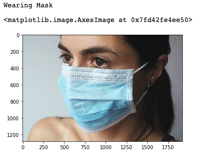

<h1>Face Mask Detection </h1>
<h2>Using Transfer Learning</h2>

<h3>Introduction </h3>
Face mask detection model is a deep learning based model which is developed with the
help of transfer learning. Model takes the image of a person as an input and predicts
whether the person is wearing a mask or not.

<h3>Dataset</h3>
Dataset is containing 12k images divided in training, testing and validation directories.
I’m only using 840 images for training and for testing 645
images and also use 4 internet downloaded images for testing the model. 
Dataset Link:- https://www.kaggle.com/ashishjangra27/face-mask-12k-images-dataset

<h3>Model</h3>
For training I’m using the VGG16 model. Model contains a total 20 layers in which 13 are
Convolutional, 1 is flatten , 1 Dense and 5 Maxpooling layers are present. Accuracy on test
data is 99.7%. Model trained for only 5 epochs.

<h3>Prediction Process</h3>
For prediction, I’m using the openCV library and Haar-cascades face-detection.xml file for
detecting the face in the image. After detecting the face in the image it crops the face part
sends to the face mask detection model for prediction.

<h3>Predictions on Downloaded Images</h3>

